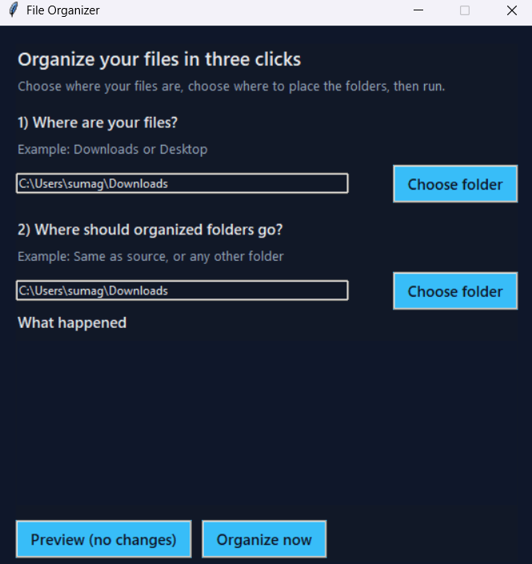
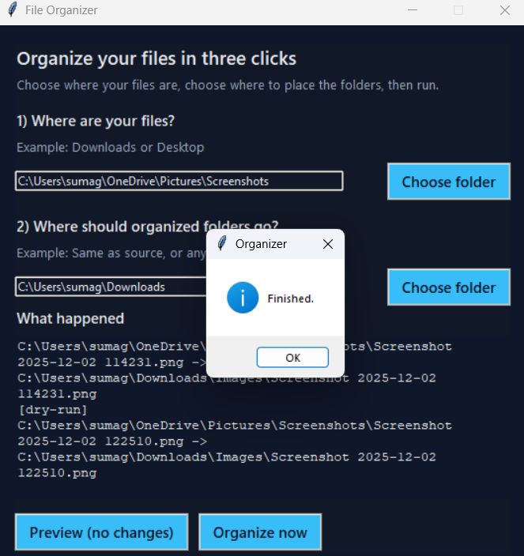

# File Organizer

Organizes files from a source folder into categorized subfolders by extension (Images, Documents, Videos, etc.). By default it sorts your `Downloads` into new subfolders inside `Downloads`, adding `_1`, `_2`, etc. to avoid name collisions.

## Screenshots (GUI)
<p align="center">
  
  <br><sub>Main screen with step-by-step prompts to pick the source folder (where your files are) and the target root (where category folders will be created).</sub>
</p>

<p align="center">
  
  <br><sub>After running, the “What happened” panel shows each move or preview so you can see exactly what changed.</sub>
</p>

## Tech Stack
- Python 3 (tested with 3.13)
- Standard library only (`argparse`, `pathlib`, `shutil`)

## Usage
Run from the project folder:
```
py -3 organizer.py --dry-run
```
This previews moves from your `Downloads` to categorized subfolders in `Downloads`.

Move for real:
```
py -3 organizer.py
```

Custom source/target:
```
py -3 organizer.py --source "C:\Path\To\Files" --target-root "C:\Path\For\Categories"
```

Flags:
- `--dry-run` shows planned moves without moving files.
- `--create-source` / `--no-create-source` to control auto-creating the source folder (default on).
